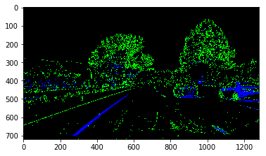
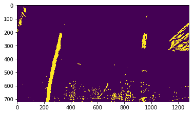

# Advanced Lane Finding
[](http://www.udacity.com/drive)


As a part of the Udacity Self-Driving Car Nanodegree Program, I developed a rule-based algorithm which detects the lane lines, along with the radius of curvature and the distance
of the vehicle (assumed as the middle point of the bottom of the image) to the ego lane center.

---

The goals / steps of this project are the following:

* Compute the camera calibration matrix and distortion coefficients given a set of chessboard images.
* Apply a distortion correction to raw images.
* Use color transforms, gradients, etc., to create a thresholded binary image.
* Apply a perspective transform to rectify binary image ("birds-eye view").
* Detect lane pixels and fit to find the lane boundary.
* Determine the curvature of the lane and vehicle position with respect to center.
* Warp the detected lane boundaries back onto the original image.
* Output visual display of the lane boundaries and numerical estimation of lane curvature and vehicle position.

## Calibrate the camera - compute translation and distortion matrices

First of all, I started computing the camera matrices which is an essential for computing the real world units such as distance
and radius and distance in meters.

To do so, I used the calibration images and created the function ```undistort()``` inside the AdvancedLaneDetection object for undistorting any input image.

below is an input image and its undistorted version: 


## Extract the s channel information using the hls color space

s channel of the hls representation is more robust to different colors for lane lines such as yellow.

```python
hls = cv2.cvtColor(undst_ln_img, cv2.COLOR_RGB2HLS)
s_channel = hls[:,:,2]

plt.imshow(hls)
```
  
Example:


## Threshold the color in pursuit of obtaining more line information then anything else in the image concerning the color space

Threshold the image in terms of the color information to get mostly the lane lines.

```python
# Threshold color channel
s_thresh_min = 170
s_thresh_max = 255
s_binary = np.zeros_like(s_channel)
s_binary[(s_channel >= s_thresh_min) & (s_channel <= s_thresh_max)] = 1

plt.imshow(s_binary, cmap='gray')
```
Example:


## Compute the absolute sobel filter output and emphasize the found pixels by multiplying them with 255 to plot the result

```python
gray = cv2.cvtColor(undst_ln_img, cv2.COLOR_RGB2GRAY)

sobelx = cv2.Sobel(gray, cv2.CV_64F, 1, 0) # Take the derivative in x
abs_sobelx = np.absolute(sobelx) # Absolute x derivative to accentuate lines away from horizontal
scaled_sobel = np.uint8(255*abs_sobelx/np.max(abs_sobelx))

plt.imshow(scaled_sobel, cmap='gray')
```

Example:


## Threshold the gradients calculated using sobel filter to get the edges clearer 

```python
# Threshold x gradient
thresh_min = 20
thresh_max = 100
sxbinary = np.zeros_like(scaled_sobel)
sxbinary[(scaled_sobel >= thresh_min) & (scaled_sobel <= thresh_max)] = 1

plt.imshow(sxbinary, cmap='gray')
```

Example:


## Visualize the contribution of both thresholding performed above
Contribution of both gradient and color information is seen below. Blue is the color information whereas the green is the gradient contribution.

```python
plt.imshow((np.dstack(( np.zeros_like(sxbinary), sxbinary, s_binary)) * 255), cmap='gray')
```
Example:



## Combine both thresholded images into one image

```python
# Combine the two binary thresholds
combined_binary = np.zeros_like(sxbinary)
combined_binary[(s_binary == 1) | (sxbinary == 1)] = 1

plt.imshow(combined_binary, cmap='gray')
```

Example:


## Perspective transform to get to BEV for radius of curvature and distance to center computations on the next step

```python
## Get to BEV
height = ln_img.shape[0]
width = ln_img.shape[1]
# Vertices coordinates in the source image
s1 = [575, 460]
s2 = [710, 460]
s3 = [315, height]
s4 = [1120, height]
src = np.float32([s1, s2, s3, s4])
# Vertices coordinates in the destination image
d1 = [300, 0]
d2 = [900, 0]
d3 = [300, height]
d4 = [900, height]
dst = np.float32([d1, d2, d3, d4])

# Given src and dst points we calculate the perspective transform matrix
M = cv2.getPerspectiveTransform(src, dst)
# Warp the image
warped = cv2.warpPerspective(undst_ln_img, M, (width, height))
# We also calculate the oposite transform
unwrap_m = cv2.getPerspectiveTransform(dst, src)

plt.figure()
plt.grid()
plt.imshow(warped)
plt.show()
```

Example:


## Combine all line detection pipeline as a method and visualize the resulting image

```python
def detection_pipeline(img, mtx, dist):
    
    undst_ln_img = cv2.undistort(img, mtx, dist, None, mtx)
    
    hls = cv2.cvtColor(undst_ln_img, cv2.COLOR_RGB2HLS)
    s_channel = hls[:,:,2]
    
    gray = cv2.cvtColor(undst_ln_img, cv2.COLOR_RGB2GRAY)

    sobelx = cv2.Sobel(gray, cv2.CV_64F, 1, 0) # Take the derivative in x
    abs_sobelx = np.absolute(sobelx) # Absolute x derivative to accentuate lines away from horizontal
    scaled_sobel = np.uint8(255*abs_sobelx/np.max(abs_sobelx))

    # Threshold x gradient
    thresh_min = 20
    thresh_max = 100
    sxbinary = np.zeros_like(scaled_sobel)
    sxbinary[(scaled_sobel >= thresh_min) & (scaled_sobel <= thresh_max)] = 1

    # Threshold color channel
    s_thresh_min = 170
    s_thresh_max = 255
    s_binary = np.zeros_like(s_channel)
    s_binary[(s_channel >= s_thresh_min) & (s_channel <= s_thresh_max)] = 1

    # Combine the two binary thresholds
    combined_binary = np.zeros_like(sxbinary)
    combined_binary[(s_binary == 1) | (sxbinary == 1)] = 1

    return combined_binary

#%%

out = detection_pipeline(warped, mtx=mtx, dist=dist)
plt.imshow(out, cmap='gray')
```

Example:


## Compute the histogram to find the peak values which we know denoting the right and left lane lines

```python
def hist(img):
    # Grab only the bottom half of the image
    # Lane lines are likely to be mostly vertical nearest to the car
    bottom_half = img[img.shape[0]//2:,:]

    # Sum across image pixels vertically - make sure to set an `axis`
    # i.e. the highest areas of vertical lines should be larger values
    histogram = np.sum(bottom_half, axis=0)
    
    return histogram

histogram = hist(out)
# Visualize the resulting histogram
plt.plot(histogram)
```
Exmaple:


## Find lane pixels and fit polynomial onto them to get the line equations

```python
def find_lane_pixels(binary_warped):
    # Take a histogram of the bottom half of the image
    histogram = np.sum(binary_warped[binary_warped.shape[0]//2:,:], axis=0)
    # Create an output image to draw on and visualize the result
    out_img = np.dstack((binary_warped, binary_warped, binary_warped))
    # Find the peak of the left and right halves of the histogram
    # These will be the starting point for the left and right lines
    midpoint = np.int(histogram.shape[0]//2)
    leftx_base = np.argmax(histogram[:midpoint])
    rightx_base = np.argmax(histogram[midpoint:]) + midpoint

    # Choose the number of sliding windows
    nwindows = 9
    # Set the width of the windows +/- margin
    margin = 100
    # Set minimum number of pixels found to recenter window
    minpix = 50

    # Set height of windows - based on nwindows above and image shape
    window_height = np.int(binary_warped.shape[0]//nwindows)
    # Identify the x and y positions of all nonzero pixels in the image
    nonzero = binary_warped.nonzero()
    nonzeroy = np.array(nonzero[0])
    nonzerox = np.array(nonzero[1])
    # Current positions to be updated later for each window in nwindows
    leftx_current = leftx_base
    rightx_current = rightx_base

    # Create empty lists to receive left and right lane pixel indices
    left_lane_inds = []
    right_lane_inds = []

    # Step through the windows one by one
    for window in range(nwindows):
        # Identify window boundaries in x and y (and right and left)
        win_y_low = binary_warped.shape[0] - (window+1)*window_height
        win_y_high = binary_warped.shape[0] - window*window_height
        win_xleft_low = leftx_current - margin
        win_xleft_high = leftx_current + margin
        win_xright_low = rightx_current - margin
        win_xright_high = rightx_current + margin
        
        # Draw the windows on the visualization image
        cv2.rectangle(out_img,(win_xleft_low,win_y_low), (win_xleft_high,win_y_high), (0,255,0), 2)
        cv2.rectangle(out_img,(win_xright_low,win_y_low), (win_xright_high,win_y_high), (0,255,0), 2) 
        
        # Identify the nonzero pixels in x and y within the window #
        good_left_inds = ((nonzeroy >= win_y_low) & (nonzeroy < win_y_high) & 
        (nonzerox >= win_xleft_low) &  (nonzerox < win_xleft_high)).nonzero()[0]
        good_right_inds = ((nonzeroy >= win_y_low) & (nonzeroy < win_y_high) & 
        (nonzerox >= win_xright_low) &  (nonzerox < win_xright_high)).nonzero()[0]
        
        # Append these indices to the lists
        left_lane_inds.append(good_left_inds)
        right_lane_inds.append(good_right_inds)
        
        # If you found > minpix pixels, recenter next window on their mean position
        if len(good_left_inds) > minpix:
            leftx_current = np.int(np.mean(nonzerox[good_left_inds]))
        if len(good_right_inds) > minpix:        
            rightx_current = np.int(np.mean(nonzerox[good_right_inds]))

    # Concatenate the arrays of indices (previously was a list of lists of pixels)
    try:
        left_lane_inds = np.concatenate(left_lane_inds)
        right_lane_inds = np.concatenate(right_lane_inds)
    except ValueError:
        # Avoids an error if the above is not implemented fully
        pass

    # Extract left and right line pixel positions
    leftx = nonzerox[left_lane_inds]
    lefty = nonzeroy[left_lane_inds] 
    rightx = nonzerox[right_lane_inds]
    righty = nonzeroy[right_lane_inds]

    return leftx, lefty, rightx, righty, out_img


def fit_polynomial(binary_warped):
    # Find our lane pixels first
    leftx, lefty, rightx, righty, out_img = find_lane_pixels(binary_warped)

    # Fit a second order polynomial to each using `np.polyfit`
    left_fit = np.polyfit(lefty, leftx, 2)
    right_fit = np.polyfit(righty, rightx, 2)

    # Generate x and y values for plotting
    ploty = np.linspace(0, binary_warped.shape[0]-1, binary_warped.shape[0] )
    try:
        left_fitx = left_fit[0]*ploty**2 + left_fit[1]*ploty + left_fit[2]
        right_fitx = right_fit[0]*ploty**2 + right_fit[1]*ploty + right_fit[2]
    except TypeError:
        # Avoids an error if `left` and `right_fit` are still none or incorrect
        print('The function failed to fit a line!')
        left_fitx = 1*ploty**2 + 1*ploty
        right_fitx = 1*ploty**2 + 1*ploty

    ## Visualization ##
    # Colors in the left and right lane regions
    out_img[lefty, leftx] = [255, 0, 0]
    out_img[righty, rightx] = [0, 0, 255]

    # Plots the left and right polynomials on the lane lines
    plt.plot(left_fitx, ploty, color='yellow')
    plt.plot(right_fitx, ploty, color='yellow')

    return out_img

binary_warped = detection_pipeline(warped, mtx, dist)

plt.imshow(binary_warped)
```

Example:



## Line pixels and the sliding windows are visualized.


# Discussion
*Please find the output project video at ```output_images/project_video_output.mp4```*.

In this project, I learned a lot by combining variety of methods in order to find the lane lines from a raw input image. Calibrating the camera as finding the transformation and the distance matrices is an important step, especially while calculating the real world distances. After undistorting the input image, using a combination of color and gradient thresholding with the proper parameters is the key point of detecting the lane lines. Using only one of them is not usually sufficient by means of different lighting and other conditions such as the position of the car. Thus combining both yields more robust results in detecting the lines. Computing the radius of curvature and the distance to the ego lane center are essential parts of autonomous driving to make decisions in the planning part.

However, this overall approach is not the best way to detect the lines, as it will struggle in extreme conditions and on roads with more curves. That's why neural net based algorithms are preferred to such rule-based methods. They can adapt and generalize better in different lighting and position conditions.
